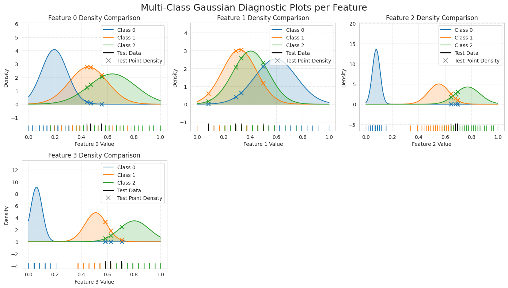
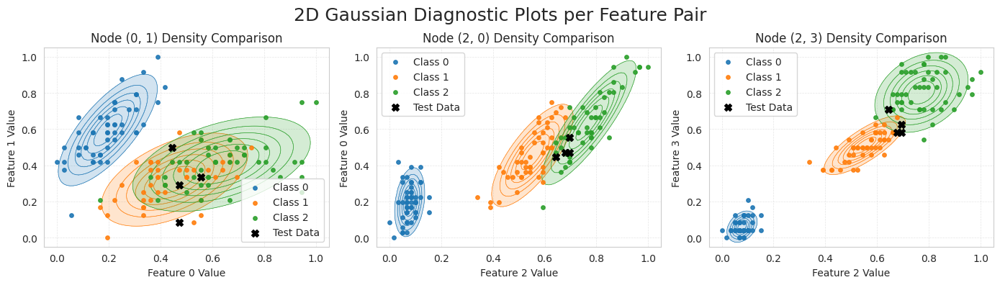
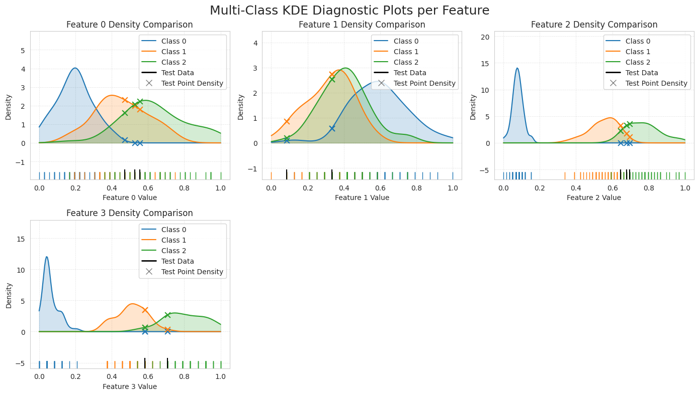
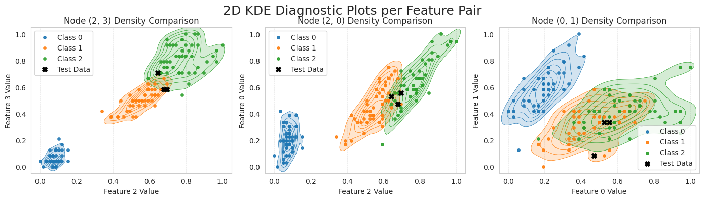
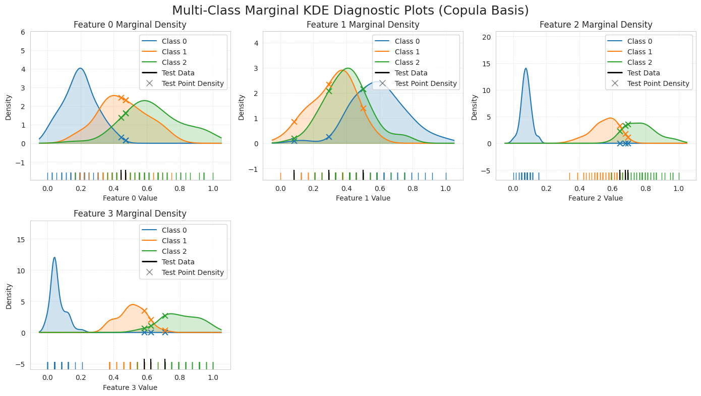
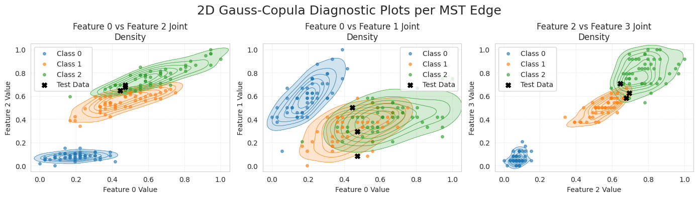
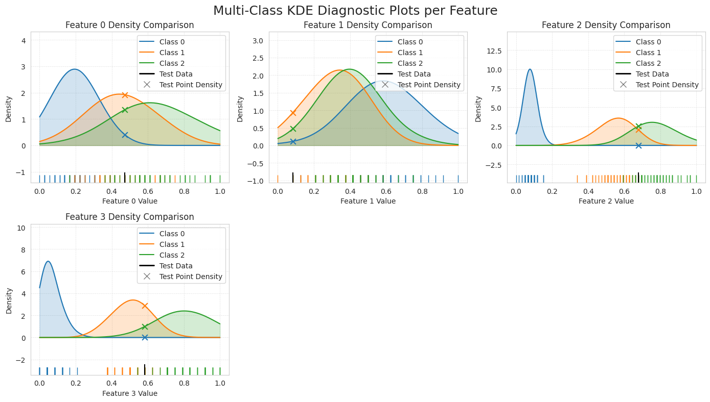
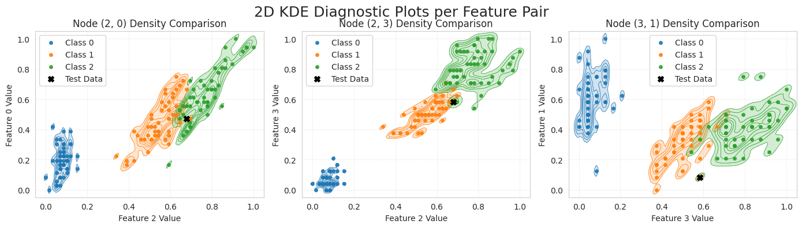

# Generalized Naive Bayes Classifier

[](https://codecov.io/github/abrahampapp/generalized-naive-bayes)
[](https://generalized-naive-bayes.readthedocs.io/en/latest/?badge=latest)
[](https://pypi.org/project/generalized-naive-bayes/)


[](https://github.com/astral-sh/ruff)
[](https://github.com/psf/black)

A mathematically rigorous, modular implementation of a Generalized Naive Bayes (GNB) classifier. This package extends the classic Naive Bayes framework by relaxing the strict conditional independence assumption, allowing the dependence between features. The method assumes that the explanatory features are continuous.

📄 **[Read the full paper on arXiv](https://arxiv.org/abs/1234.56789)**

---

## Table of Contents

- [Overview](#overview)
- [Key Features](#key-features)
- [Installation](#installation)
- [Quick Start](#quick-start)
- [Usage Guide](#usage-guide)
  - [Data Preparation](#0-data-preparation)
  - [Gaussian Mode](#1-gaussian-mode)
  - [KDE Mode](#2-kde-mode)
  - [Copula Mode](#3-copula-mode)
  - [Model Diagnostics](#5-model-diagnostics)
- [Citation](#citation)

---

## Overview

Traditional Naive Bayes assumes that all features are conditionally independent given the class—a mathematically convenient but often unrealistic assumption.

The **Generalized Naive Bayes Classifier** constructs a probabilistic graphical model on the explanatory variables together with the class variable consisting of clusters of size three and separator of size two.
The method works under three different assumptions regarding the joint probability distributions of the features: multivariate Gaussian distribution; the dependence struture modeled by Gauss copulas with arbitrary marginals, the most general case without restriction on the dependence structure and marginals.

## Key Features

✨ **Triple Operating Architecture**
- **Gaussian Mode (`GaussianGeneralizedNB`)**: Assumes Gaussian distributions for univariate features and bivariate feature pairs.
- **General Mode (`KDEGeneralizedNB`)**: Fully non-parametric. Uses Kernel Density Estimation (KDE) for modeling distributions.
- **Copula Mode (`CopulaGeneralizedNB`)**: Fuses KDE marginals with a the dependence structue described by Gaussian copula.

🎯 **Strict Graph Theory Mathematics**
- Adheres rigidly to the theoretical GNB framework: $\log p(y, \mathbf{x}) = \sum \log p(y, x_i, x_j) - \sum (v_s - 1) \log p(y, x_s)$.
- Natively evaluates true joint distributions.

✂️ **Model Reduction & Truncation**
- Prevent overfitting by pruning the probabilistic graphical model chosing thos which give the maximum information (wight) on the training/ validation data.

📊 **Comprehensive Diagnostics**
- Built-in visualization tools for 1D and 2D distributions.
- Misclassification analysis.

🔧 **Scikit-learn Compatible**
- Follows scikit-learn API conventions
- Easy integration into existing ML pipelines
- Standard `fit`, `predict`, and `predict_proba` methods

## Installation

### From PyPI

```bash
pip install generalized-naive-bayes
```

### From Source

```bash
git clone https://github.com/abrahampapp/generalized-naive-bayes.git
cd generalized-naive-bayes
pip install -e .
```

### Requirements

- Python ≥ 3.11
- NumPy ≥ 2.3.2
- Scikit-learn ≥ 1.7.1
- Matplotlib ≥ 3.10.5
- SciPy ≥ 1.16.1
- NetworkX ≥ 3.6.1
- Seaborn ≥ 0.13.2

---

## Quick Start
[](https://colab.research.google.com/github/AbrahamPapp/generalized-naive-bayes/blob/main/notebooks/iris_demo.ipynb)
```python
from sklearn.datasets import load_iris
from sklearn.preprocessing import MinMaxScaler

from generalized_naive_bayes import GeneralizedNaiveBayes

# Load data
iris = load_iris()
X, y = iris.data, iris.target

# Scale features
scaler = MinMaxScaler()
X_scaled = scaler.fit_transform(X)

# Train classifier
classifier = GeneralizedNaiveBayes()
classifier.fit(X_scaled, y, input_features_type="gaussian")

# Make predictions
y_pred = classifier.predict(X_scaled)
accuracy = (y_pred == y).mean()
print(f"Accuracy: {accuracy:.2%}")  # ~97.3%
```

---

## Usage Guide

This comprehensive guide demonstrates the operating modes using the classic Iris dataset.

### 0. Data Preparation

#### Load and Explore the Dataset

```python
import pandas as pd
from sklearn.datasets import load_iris
from sklearn.preprocessing import LabelEncoder

# Load the dataset
iris = load_iris()

# Create a pandas DataFrame
df = pd.DataFrame(data=iris.data, columns=iris.feature_names)
df["label"] = pd.Series(iris.target_names[iris.target], dtype="category")

# Encode the string labels into integers (0, 1, 2)
label_encoder = LabelEncoder()
df["label_encoded"] = label_encoder.fit_transform(df["label"])

df.sample(5)
```

**Sample Output:**

| | sepal length (cm) | sepal width (cm) | petal length (cm) | petal width (cm) | label | label_encoded |
|---|---|---|---|---|---|---|
| 44 | 5.1 | 3.8 | 1.9 | 0.4 | setosa | 0 |
| 91 | 6.1 | 3.0 | 4.6 | 1.4 | versicolor | 1 |
| 143 | 6.8 | 3.2 | 5.9 | 2.3 | virginica | 2 |
| 19 | 5.1 | 3.8 | 1.5 | 0.3 | setosa | 0 |
| 146 | 6.3 | 2.5 | 5.0 | 1.9 | virginica | 2 |

#### Dataset Characteristics

- **Samples**: 150 total (50 per class)
- **Features**: 4 continuous measurements
  - Sepal Length (cm)
  - Sepal Width (cm)
  - Petal Length (cm)
  - Petal Width (cm)
- **Classes**: 3 species (Setosa, Versicolor, Virginica)
- **Task**: Multi-class classification

#### Feature Scaling

```python
from sklearn.preprocessing import MinMaxScaler

# Extract features and target
X = df.iloc[:, :-2].values
y = df["label_encoded"].values

# Scale features (important for KDE-based methods)
scaler = MinMaxScaler()
X_scaled = scaler.fit_transform(X)
```

**Note**: Feature scaling is must have, especially for the KDE mode.

---

### 1. Gaussian Mode

The underlying `estimator_` is called `GaussianGeneralizedNB`. It evaluates bivariate and univariate normal distributions. It maps perfectly to datasets where features exhibit traditional bell-curve behavior.

#### Initialize and Train

```python
from generalized_naive_bayes import GeneralizedNaiveBayes

# Initialize with Gaussian assumption
classifier = GeneralizedNaiveBayes(distribution="gaussian")

# Fit the model
classifier.fit(X_scaled, y)
```

#### Make Predictions

```python
from sklearn.metrics import accuracy_score

# Predict class labels
y_pred = classifier.predict(X_scaled)

# Calculate accuracy
accuracy = accuracy_score(y_true=y, y_pred=y_pred)
print(f"Training Accuracy: {accuracy:.2%}")  # ~97.33%
```

#### Visualize Model Diagnostics

Peak into the model and get to know how the model predicted the output

```python
from generalized_naive_bayes import GaussianGeneralizedNB
from generalized_naive_bayes.plotting import (
    plot_1d_gaussian_diagnostics,
    plot_2d_gaussian_diagnostics,
)

assert isinstance(classifier.estimator_, GaussianGeneralizedNB)
assert classifier.estimator_.params_ is not None

# 1D Gaussian diagnostics
plot_1d_gaussian_diagnostics(
    uni_means=classifier.estimator_.params_.uni_means,
    uni_vars=classifier.estimator_.params_.uni_vars,
    X=X_scaled,
    y=y,
    classes=classifier.classes_,
    X_test=X_scaled[y_pred != y, :],  # Highlight misclassified samples
)

# 2D Gaussian diagnostics
plot_2d_gaussian_diagnostics(
    multi_means=classifier.estimator_.params_.multi_means,
    multi_cov=classifier.estimator_.params_.multi_covs,
    X=X_scaled,
    y=y,
    classes=classifier.classes_,
    nodes=classifier.estimator_.feature_pairs_,
    X_test=X_scaled[y_pred != y, :],  # Highlight misclassified samples
)
```

#### Gaussian Mode Results

**1D Feature Distributions**



*Univariate Gaussian fits for each feature across the three iris species. Misclassified samples (highlighted) occur primarily in overlapping regions between classes.*

**2D Feature Pair Distributions**



*Bivariate Gaussian fits for selected feature pairs. The model captures joint distributions that provide better class separation than individual features alone.*


### Model reduction

#### We can limit the number of clusters used by the model in the `.predict()` call if we are using a simple greedy feature selection algorithm (by default using a separate algorithm called DMST)


The Generalized Naive Bayes formula relies on graph theory (Clusters and Separators). If you want to prevent overfitting, you can limit the model to only the $k$ most informative edges using `num_feature_pairs_to_predict`.


```python
from generalized_naive_bayes import FeatureSelection

classifier = GeneralizedNaiveBayes(
    distribution="gaussian", feature_pair_selection=FeatureSelection.GREEDY
)

classifier.fit(X=X_scaled, y=y)
y_pred_general = classifier.predict(X_scaled, num_feature_pairs_to_predict=1)

# Accuracy - Small change compared to previous ~97.33%
accuracy = accuracy_score(y_true=y, y_pred=y_pred_general)
print(f"Training Accuracy: {accuracy:.2%}")
```

---

### 2. KDE mode

##### Here we can use distribution = 'kde' to approaximate distribution with a kernel

The `KDEGeneralizedNB` uses Kernel Density Estimation. It thrives on multi-modal distributions where Gaussian assumptions fail.

#### Initialize and Train

```python
classifier = GeneralizedNaiveBayes(distribution="kde")

classifier.fit(X=X_scaled, y=y)
y_pred_general = classifier.predict(X_scaled)

# Accuracy
accuracy = accuracy_score(y_true=y, y_pred=y_pred_general)
print(f"Training Accuracy: {accuracy:.2%}")  # ~98.00%
```

#### Visualize Model Diagnostics

```python
from generalized_naive_bayes.utils.plot_functions import (
    plot_1d_kde_diagnostics,
    plot_2d_kde_diagnostics,
)

plot_1d_kde_diagnostics(
    kde_fits=classifier.single_kde_fits,
    X=X_scaled,
    y=y,
    classes=classifier.classes_,
    X_test=X_scaled[y_pred_general != y, :],
)

plot_2d_kde_diagnostics(
    kde_fits=classifier.multi_kde_fits,
    X=X_scaled,
    y=y,
    classes=classifier.classes_,
    nodes=classifier.feature_pairs_,
    X_test=X_scaled[y_pred_general != y, :],
)
```

#### KDE Mode Results

**1D KDE Distributions**



*Non-parametric density estimates using RBF kernels for each feature. KDE captures multi-modal and asymmetric distributions that Gaussian assumptions might miss.*

**2D KDE Distributions**



*Bivariate KDE for selected feature pairs. The flexible kernel approach models complex joint distributions, leading to improved classification in overlapping regions.*


### 3. Copula mode

The underlying estimator in this case is called `CopulaGeneralizedNB`. It maps the features into a uniform space using KDE CDFs, then links them using a Gaussian Copula correlation matrix. This isolates the marginal distributions from the dependence structure.

```python
classifier = GeneralizedNaiveBayes(distribution="gauss-copula")

classifier.fit(X=X_scaled, y=y)
y_pred_copula = classifier.predict(X_scaled)

# Accuracy
accuracy = accuracy_score(y_true=y, y_pred=y_pred_copula)
print(f"Training Accuracy: {accuracy:.2%}")  # ~98.00%
```


```python
from generalized_naive_bayes import CopulaGeneralizedNB
from generalized_naive_bayes.plotting import (
    plot_1d_copula_diagnostics,
    plot_2d_copula_diagnostics,
)

assert isinstance(classifier.estimator_, CopulaGeneralizedNB)

# 1. Plot the Marginals (1D)
plot_1d_copula_diagnostics(
    class_kdes=classifier.estimator_.class_kdes_,
    X=X_scaled,
    y=y,
    classes=classifier.classes_,
    X_test=X_scaled[y_pred_copula != y, :],
)

# 2. Plot the Joint Densities dictated by the Spanning Tree (2D)
plot_2d_copula_diagnostics(
    class_kdes=classifier.estimator_.class_kdes_,
    class_corr_matrices=classifier.estimator_.class_corr_matrices_,
    X=X_scaled,
    y=y,
    classes=classifier.classes_,
    nodes=classifier.estimator_.feature_pairs_,
    X_test=X_scaled[y_pred_copula != y, :],
)
```

**1D KDE Distributions with gaussian dependency**



*Non-parametric density estimates using RBF kernels for each feature. KDE captures multi-modal and asymmetric distributions that Gaussian assumptions might miss.*

**2D KDE Distributions**



*Bivariate KDE for selected feature pairs. The flexible kernel approach models complex joint distributions and keeps dependency as gaussian.*

---

### 5. Model Diagnostics

#### Understanding the Visualizations

**Misclassification Analysis**
- Misclassified samples are highlighted in the diagnostic plots
- Most errors occur in regions where class distributions overlap significantly
- Visual inspection helps identify whether modeling assumptions are appropriate

**Distribution Quality**
- Check if fitted distributions match the empirical data well
- Compare Gaussian vs. KDE fits to assess distributional assumptions
- Identify multi-modal or skewed distributions that benefit from KDE

**Feature Pair Selection**
- The classifier automatically selects informative feature pairs
- Selected pairs (shown in 2D plots) maximize mutual information with the target
- This provides insight into which feature combinations are most discriminative

---

#### Parameter tuning: We have included many parameters to play around with.

```python
from generalized_naive_bayes import (
    EntropyApprox,
    EntropyKDE,
    FeatureSelection,
    GeneralizedNaiveBayes,
)

classifier = GeneralizedNaiveBayes(
    distribution="kde",
    feature_pair_selection=FeatureSelection.DMST,
    entropy_approx_method=EntropyApprox.KDE_BASED,
    entropy_kde_method=EntropyKDE.UNIFORM_GRID,
    bw_method_double=0.3,
    bw_method_single=1.0,
)

classifier.fit(X=X_scaled, y=y)

y_pred_general = classifier.predict(X_scaled)

# Accuracy
accuracy = accuracy_score(y_true=y, y_pred=y_pred_general)
print(f"Training Accuracy: {accuracy:.2%}")  # ~99.33%
```





*We can see how powerful general KDE based approach really is. The only downside it to find the parameters which best fits the data*

---

### Reporting Issues

Please report bugs and feature requests through [GitHub Issues](https://github.com/abrahampapp/generalized-naive-bayes/issues).

---

## Citation

If you use this package in your research, please cite our paper:

```bibtex
@article{XXXXXXXXXXXXXXXXXX,
  title={On Generalized Naive Bayes with Continuous Features},
  author={Ábrahám Papp, Botond Szilágyi, Edith Alice Kovács},
  journal={arXiv preprint arXiv:1234.56789},
  year={2026}
}
```

---

## Contact & Support

- **Documentation**: [Read the Docs](https://generalized-naive-bayes.readthedocs.io/)
- **Issue Tracker**: [GitHub Issues](https://github.com/abrahampapp/generalized-naive-bayes/issues)
- **PyPI Package**: [generalized-naive-bayes](https://pypi.org/project/generalized-naive-bayes/)

---
