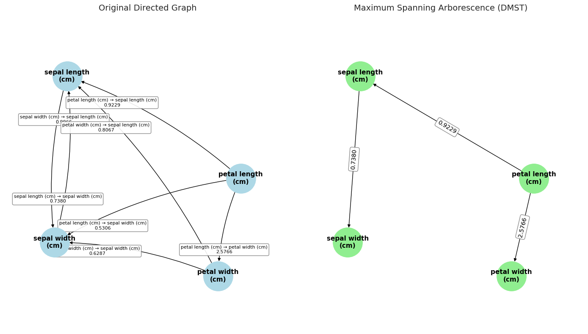

# Generalized Naive Bayes Classifier

[](https://codecov.io/github/abrahampapp/generalized-naive-bayes)
[](https://your-project-name.readthedocs.io/en/latest/?badge=latest)
[](https://pypi.org/project/generalized-naive-bayes/)


[](https://github.com/astral-sh/ruff)
[](https://github.com/psf/black)

A flexible and modular implementation of a generalized Naive Bayes classifier that extends the classic Naive Bayes model by modeling feature pairs selected based on information theory. The classifier models the joint mutual information between continuous input feature pairs and discrete target variables.

📄 **[Read the full paper on arXiv](https://arxiv.org/abs/1234.56789)**

---

## Table of Contents

- [Overview](#overview)
- [Key Features](#key-features)
- [Installation](#installation)
- [Quick Start](#quick-start)
- [Usage Guide](#usage-guide)
  - [Data Preparation](#1-data-preparation)
  - [Gaussian Mode](#2-gaussian-mode)
  - [General Mode (KDE)](#3-general-mode-kde)
  - [Model Diagnostics](#4-model-diagnostics)
- [Reporting Issues](#reporting-issues)
- [Citation](#citation)
- [Contact & Support](#contact--support)

---

## Overview

The **Generalized Naive Bayes Classifier** extends traditional Naive Bayes by:

- Modeling dependencies between feature pairs using mutual information
- Supporting both Gaussian and non-parametric (KDE) distributions
- Providing interpretable diagnostics and visualizations
- Offering flexible kernel density estimation for complex distributions

This approach captures richer relationships in the data while maintaining computational efficiency and interpretability.

## Key Features

✨ **Dual Operating Modes**
- **Gaussian Mode**: Assumes Gaussian distributions for features and feature pairs
- **General Mode**: Uses Kernel Density Estimation (KDE) with RBF kernel for non-parametric modeling

🎯 **Information-Theoretic Feature Selection**
- Automatically selects informative feature pairs based on mutual information
- Balances model complexity with predictive performance

📊 **Comprehensive Diagnostics**
- Built-in visualization tools for 1D and 2D distributions
- Misclassification analysis and error visualization
- Distribution fitting quality assessment

🔧 **Scikit-learn Compatible**
- Follows scikit-learn API conventions
- Easy integration into existing ML pipelines
- Standard `fit`, `predict`, and `predict_proba` methods

## Installation

### From PyPI

```bash
pip install generalized-naive-bayes
```

### From Source

```bash
git clone https://github.com/abrahampapp/generalized-naive-bayes.git
cd generalized-naive-bayes
pip install -e .
```

### Requirements

- Python ≥ 3.11
- NumPy ≥ 2.3.2
- Scikit-learn ≥ 1.7.1
- Matplotlib ≥ 3.10.5
- SciPy ≥ 1.16.1

---

## Quick Start
[](https://colab.research.google.com/github/AbrahamPapp/generalized-naive-bayes/blob/main/notebooks/iris%20demo.ipynb)
```python
from sklearn.datasets import load_iris
from sklearn.preprocessing import MinMaxScaler

from generalized_naive_bayes import GeneralizedNaiveBayesClassifier

# Load data
iris = load_iris()
X, y = iris.data, iris.target

# Scale features
scaler = MinMaxScaler()
X_scaled = scaler.fit_transform(X)

# Train classifier
classifier = GeneralizedNaiveBayesClassifier()
classifier.fit(X_scaled, y, input_features_type="gaussian")

# Make predictions
y_pred = classifier.predict(X_scaled)
accuracy = (y_pred == y).mean()
print(f"Accuracy: {accuracy:.2%}")  # ~97.3%
```

---

## Usage Guide

This comprehensive guide demonstrates both operating modes using the classic Iris dataset.

### 1. Data Preparation

#### Load and Explore the Dataset

```python
import pandas as pd
from sklearn.datasets import load_iris
from sklearn.preprocessing import LabelEncoder

# Load the dataset
iris = load_iris()

# Create a pandas DataFrame
df = pd.DataFrame(data=iris.data, columns=iris.feature_names)
df["label"] = pd.Series(iris.target_names[iris.target], dtype="category")

# Encode the string labels into integers (0, 1, 2)
label_encoder = LabelEncoder()
df["label_encoded"] = label_encoder.fit_transform(df["label"])

df.sample(5)
```

**Sample Output:**

| | sepal length (cm) | sepal width (cm) | petal length (cm) | petal width (cm) | label | label_encoded |
|---|---|---|---|---|---|---|
| 44 | 5.1 | 3.8 | 1.9 | 0.4 | setosa | 0 |
| 91 | 6.1 | 3.0 | 4.6 | 1.4 | versicolor | 1 |
| 143 | 6.8 | 3.2 | 5.9 | 2.3 | virginica | 2 |
| 19 | 5.1 | 3.8 | 1.5 | 0.3 | setosa | 0 |
| 146 | 6.3 | 2.5 | 5.0 | 1.9 | virginica | 2 |

#### Dataset Characteristics

- **Samples**: 150 total (50 per class)
- **Features**: 4 continuous measurements
  - Sepal Length (cm)
  - Sepal Width (cm)
  - Petal Length (cm)
  - Petal Width (cm)
- **Classes**: 3 species (Setosa, Versicolor, Virginica)
- **Task**: Multi-class classification

#### Feature Scaling

```python
from sklearn.preprocessing import MinMaxScaler

# Extract features and target
X = df.iloc[:, :-2].values
y = df["label_encoded"].values

# Scale features (important for KDE-based methods)
scaler = MinMaxScaler()
X_scaled = scaler.fit_transform(X)
```

**Note**: Feature scaling is strongly recommended, especially for the General (KDE) mode, as it improves numerical stability and kernel performance.

---

### 2. Gaussian Mode

The Gaussian mode assumes that features follow Gaussian distributions, fitting univariate and multivariate Gaussians for each class.

#### Initialize and Train

```python
from generalized_naive_bayes import GeneralizedNaiveBayesClassifier

# Initialize with Gaussian assumption
classifier = GeneralizedNaiveBayesClassifier()

# Fit the model
classifier.fit(X_scaled, y, input_features_type="gaussian")
```

#### Make Predictions

```python
from sklearn.metrics import accuracy_score

# Predict class labels
y_pred = classifier.predict(X_scaled)

# Calculate accuracy
accuracy = accuracy_score(y_true=y, y_pred=y_pred)
print(f"Training Accuracy: {accuracy:.2%}")  # ~97.33%
```

#### Visualize Model Diagnostics

```python
from generalized_naive_bayes.utils.plot_functions import (
    plot_1d_gaussian_diagnostics,
    plot_2d_gaussian_diagnostics,
)

# 1D Gaussian diagnostics
plot_1d_gaussian_diagnostics(
    uni_means=classifier.uni_means,
    uni_vars=classifier.uni_var,
    X=X_scaled,
    y=y,
    classes=classifier.classes_,
    X_test=X_scaled[y_pred != y, :],  # Highlight misclassified samples
)

# 2D Gaussian diagnostics
plot_2d_gaussian_diagnostics(
    multi_means=classifier.multi_means,
    multi_cov=classifier.multi_covs,
    X=X_scaled,
    y=y,
    classes=classifier.classes_,
    nodes=classifier.feature_pairs_,
    X_test=X_scaled[y_pred != y, :],  # Highlight misclassified samples
)
```

#### Gaussian Mode Results

**1D Feature Distributions**


*Univariate Gaussian fits for each feature across the three iris species. Misclassified samples (highlighted) occur primarily in overlapping regions between classes.*

**2D Feature Pair Distributions**


*Bivariate Gaussian fits for selected feature pairs. The model captures joint distributions that provide better class separation than individual features alone.*

---

### 3. General Mode (KDE)

The General mode uses Kernel Density Estimation (KDE) with RBF kernels, making no distributional assumptions about the features. Features are selected based on information theoretic calculations.

#### Initialize and Train

```python
classifier = GeneralizedNaiveBayesClassifier()

classifier.fit(
    X=X_scaled, y=y, input_features_type="general", feature_pair_selection="dmst"
)
y_pred_general = classifier.predict(X_scaled)

# Accuracy
accuracy = accuracy_score(y_true=y, y_pred=y_pred_general)
print(f"Training Accuracy: {accuracy:.2%}")  # ~96.67%
```


#### Look inside the model by using helper functions

```python
from generalized_naive_bayes.utils.plot_functions import visualize_arborescence

visualize_arborescence(
    graph=classifier.feature_graph_,
    dmst_graph=classifier.dmst_graph_,
    figsize=(14, 8),
    column_names=iris.feature_names,
    random_seed=17,
)
```

**Directed maximum spanning for finding most suitable feature pairs**



*Based on directed graph of all features, select the pairs with maximum information*


#### Multiple hyperparameters to choose from

```python
classifier = GeneralizedNaiveBayesClassifier()

classifier.fit(
    X=X_scaled, y=y, input_features_type="general", feature_pair_selection="greedy"
)
y_pred_general = classifier.predict(X_scaled)

# Accuracy
accuracy = accuracy_score(y_true=y, y_pred=y_pred_general)
print(f"Training Accuracy: {accuracy:.2%}")  # ~98.00%
```

**Performance Note**: The General mode achieves ~98.00% accuracy (147/150 correct) compared to ~97.33% (146/150) in Gaussian mode, demonstrating the benefit of non-parametric modeling for this dataset, but performance varies across datasets.

#### Visualize Model Diagnostics

```python
from generalized_naive_bayes.utils.plot_functions import (
    plot_1d_kde_diagnostics,
    plot_2d_kde_diagnostics,
)

plot_1d_kde_diagnostics(
    kde_fits=classifier.single_kde_fits,
    X=X_scaled,
    y=y,
    classes=classifier.classes_,
    X_test=X_scaled[y_pred_general != y, :],
)

plot_2d_kde_diagnostics(
    kde_fits=classifier.multi_kde_fits,
    X=X_scaled,
    y=y,
    classes=classifier.classes_,
    nodes=classifier.feature_pairs_,
    X_test=X_scaled[y_pred_general != y, :],
)
```

#### General Mode Results

**1D KDE Distributions**


*Non-parametric density estimates using RBF kernels for each feature. KDE captures multi-modal and asymmetric distributions that Gaussian assumptions might miss.*

**2D KDE Distributions**


*Bivariate KDE for selected feature pairs. The flexible kernel approach models complex joint distributions, leading to improved classification in overlapping regions.*

---

### 4. Model Diagnostics

#### Understanding the Visualizations

**Misclassification Analysis**
- Misclassified samples are highlighted in the diagnostic plots
- Most errors occur in regions where class distributions overlap significantly
- Visual inspection helps identify whether modeling assumptions are appropriate

**Distribution Quality**
- Check if fitted distributions match the empirical data well
- Compare Gaussian vs. KDE fits to assess distributional assumptions
- Identify multi-modal or skewed distributions that benefit from KDE

**Feature Pair Selection**
- The classifier automatically selects informative feature pairs
- Selected pairs (shown in 2D plots) maximize mutual information with the target
- This provides insight into which feature combinations are most discriminative

---

#### Parameter tuning: We have included many parameters to play around with.

```python
classifier = GeneralizedNaiveBayesClassifier()

classifier.fit(
    X=X_scaled,
    y=y,
    input_features_type="general",
    feature_pair_selection="dmst",
    entropy_approx_method="kde_based",
    entropy_kde_method="uniform_grid",
    bw_method_double=0.3,
    bw_method_single=1.0,
)
y_pred_general = classifier.predict(X_scaled)

# Accuracy
accuracy = accuracy_score(y_true=y, y_pred=y_pred_general)
print(f"Training Accuracy: {accuracy:.2%}")  # ~99.33%
```


*We can see how powerful general KDE based approach really is. The only downside it to find the parameters which best fits the data*

---

### Reporting Issues

Please report bugs and feature requests through [GitHub Issues](https://github.com/abrahampapp/generalized-naive-bayes/issues).

---

## Citation

If you use this package in your research, please cite our paper:

```bibtex
@article{yourname2024generalized,
  title={Generalized Naive Bayes: A Feature-Pair Approach with Mutual Information},
  author={Your Name and Collaborators},
  journal={arXiv preprint arXiv:1234.56789},
  year={2024}
}
```

---

## Contact & Support

- **Documentation**: [Read the Docs](https://your-project-name.readthedocs.io/)
- **Issue Tracker**: [GitHub Issues](https://github.com/abrahampapp/generalized-naive-bayes/issues)
- **PyPI Package**: [generalized-naive-bayes](https://pypi.org/project/generalized-naive-bayes/)

---
